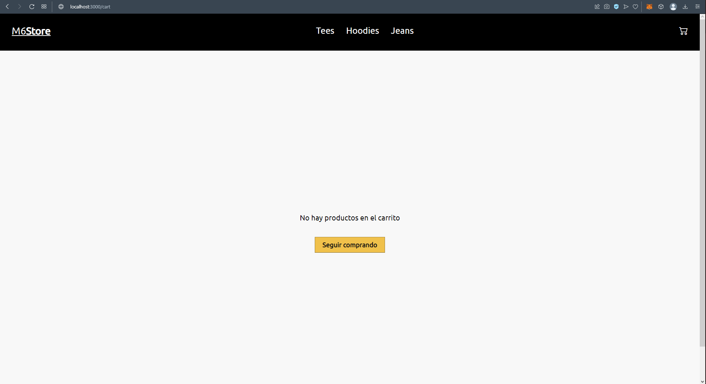

# Proyecto ecommerce coderhouse

esta aplicacion web fue creada con React

## Aplicacion 

Fue creada y diseñada desde 0 utilizando jsx, los componentes se estilaron con css. Se aplicaron rutas para mejorar la navegacion de la pagina y se aplico firebase para cargar los productos.

# Pagina principal

Aqui veremos la barra de navegacion y todos los productos de la pagina y podremos seleccionar cada uno.
Al tocar el logo de la pagina tambien nos mandara a esta pagina principal.

## Secciones

### Tees

Al hacer click en Tees veremos el catalogo de remeras 

### Hoodies

Al hacer click en Hoodies veremos el catalogo de buzos 

### Jeans

Al hacer click en Jeans veremos el catalogo de pantalones 

### Carrito

Al hacer click en el carrito cuando este esta vacio veremos la pagina del carrito vacio 

De lo contrario si el carrito contiene productos dentro los veremos reflejados en el icono y en la pagina 

### Orden generada

Al generar una orden nos llegara a firebase el id y los productos 

